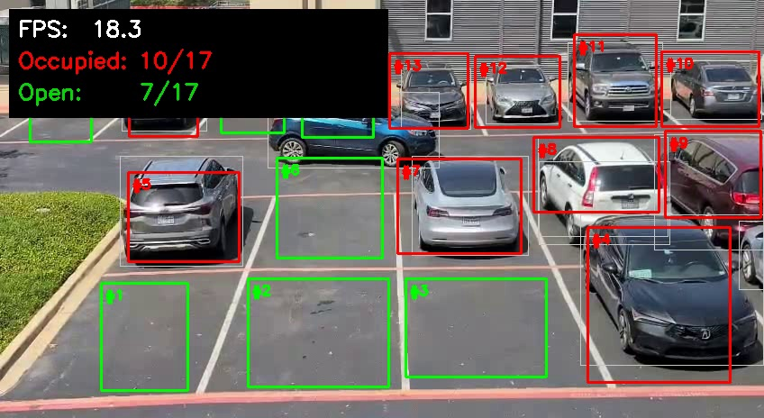

# UTD Parking Spot Occupancy Detector

> Real-time per-spot parking occupancy from a fixed camera feed.
> CS 6384 (Computer Vision), Spring 2026, **Group 34** at UT Dallas.

**Team:** Nikita Ramachandran &middot; Sandeep Jammula &middot; Praneeth Kumar Rachepalli &middot; Eswardeep Pujala
**Set 2 presentation:** Thu 04/30 &middot; **eLearning submission deadline:** Wed 04/29
**Project category:** Application-oriented (per course rubric)

---

## 1. What this project is, in one paragraph

Driving onto a UTD parking lot, you only see a sign with the lot-level free count.
You still circle floor-by-floor looking for an actual spot. This project takes a
single fixed parking-lot camera feed (a phone on a ledge is enough) and outputs,
**in real time on a CPU**, an Occupied/Empty label for every parking spot in the
view, plus a live "X spots open" counter. There is **no per-camera training** and
**no fine-tuning** — the system uses an off-the-shelf YOLOv8n detector pre-trained
on COCO, a one-time set of static parking-spot rectangles registered for that
camera, and a simple IoU > 0.5 decision rule between detected vehicles and spots.

```
Camera frame -> YOLOv8n vehicle boxes -> IoU vs static ROIs -> Occupied / Empty per spot
```

---

## 2. Headline results (real, measured)

Both columns are real numbers. The "UTD live" column is the on-campus recording
this team made with a phone, evaluated against 165 manually-labeled ground-truth
judgments.

| Metric                         | Synthetic 90-frame test | **UTD live (41 s clip)**   |
|---|---|---|
| Total (frame, spot) judgments  | 810                     | 85                         |
| Occupancy Accuracy             | 79.6 %                  | **97.6 %**                 |
| Precision (Occupied)           | 100.0 %                 | **98.2 %**                 |
| Recall (Occupied)              | 74.2 %                  | **98.2 %**                 |
| F1 (Occupied)                  | 85.2 %                  | **98.2 %**                 |
| Inference FPS (CPU)            | 5.9                     | **17.3**                   |
| End-to-end FPS (incl. video I/O) | 4.8                   | **15.7**                   |

The UTD live run produces only **two errors in 85 judgments** &mdash; one false
positive and one false negative on adjacent back-row spots in a single frame
where a vehicle straddles the ROI boundary. See
[`results/metrics_utd.json`](results/metrics_utd.json) for the full output and
[`results/utd_demo.mp4`](results/utd_demo.mp4) for the rendered demo.

A snapshot of the rendered demo:



White = raw YOLO vehicle detections, red = ROI labelled Occupied, green = ROI
labelled Open. The HUD reports live FPS and both counts.

---

## 3. Repository layout

```
.
├── README.md                         <- you are here
├── AGENTS.md                         <- structured project state for Cursor agents (read first if you are an AI)
├── PROJECT_PLAN.md                   <- 3-day plan + status snapshot
├── REALTIME_GUIDE.md                 <- webcam / IP-camera / RTSP walkthrough
├── SUBMISSION_CHECKLIST.md           <- eLearning submission checklist + filenames
│
├── CV_Project_Proposal_Group34.pdf   <- our proposal (the locked design)
├── project_description.pdf           <- course handout
├── project_presentation.pdf          <- presentation rubric
├── project_report.pdf                <- report rubric
│
├── code/                             <- all Python; see code/README.md for usage
│   ├── README.md
│   ├── requirements.txt
│   ├── main.py                       <- the detector (file / webcam / RTSP)
│   ├── roi_picker.py                 <- click 2 corners per spot -> rois.json
│   ├── label_gt.py                   <- keyboard-driven ground-truth labeler
│   ├── evaluate.py                   <- Acc / Prec / Rec / F1 / FPS reporter
│   ├── auto_rois.py                  <- extract ROIs from frame 1 via YOLO
│   ├── inspect_video.py              <- vet a candidate video (metadata + YOLO sanity check)
│   ├── snapshot_demo.py              <- pull a frame + summarize predictions JSON
│   ├── make_test_video.py            <- synthesize a labelled test video from a still
│   ├── extract_figures.py            <- regenerate the report's 3 figures
│   └── convert_carpark_positions.py  <- adapt the public sample's pickle
│
├── data/
│   ├── videos/
│   │   ├── utd_parking_sample.mp4    <- 41 s on-campus recording, used for demo + eval
│   │   ├── carPark.mp4               <- public sample (documents the top-down failure)
│   │   └── synthetic_lot.mp4         <- 90-frame synthetic stress test
│   ├── frames/                       <- inspection JPGs + YOLO-annotated mid-frames
│   ├── rois_utd.json                 <- 17 spots manually drawn with roi_picker.py
│   ├── rois_carpark.json             <- 69 spots converted from the public sample
│   ├── rois_synthetic.json           <- 9 spots from the synthetic test
│   ├── ground_truth/gt_utd.json      <- 5 frames x 17 spots = 85 manual labels
│   └── ground_truth/gt_synthetic.json
│
├── results/
│   ├── utd_demo.mp4                  <- HEADLINE demo for the presentation
│   ├── utd_demo_predictions.json     <- per-frame occupancy predictions
│   ├── metrics_utd.json              <- HEADLINE metrics
│   ├── synthetic_demo.mp4            <- backup demo on the synthetic test
│   └── metrics_synthetic.json
│
├── report/
│   ├── main.tex                      <- CVPR template body, 5-6 pages, real numbers
│   ├── refs.bib                      <- 12 references
│   └── figures/                      <- pipeline / qualitative / failures PNGs
│
└── presentation/
    ├── slides.pptx                   <- 10-slide deck, real numbers in Slide 6
    ├── slides_outline.md             <- per-speaker scripts, <= 5:00 timing budget
    └── build_pptx.py                 <- regenerate slides.pptx from the outline
```

---

## 4. Quick start (for teammates cloning the repo)

You need **Python 3.9+**. On the team's primary Windows box the verified
interpreter is `C:\Users\91767\miniconda3\envs\bigdata\python.exe`. On
macOS / Linux any 3.9+ Python works.

```bash
git clone https://github.com/Eswar-deep/CV-assignment.git
cd CV-assignment

python -m venv .venv
# Windows:
.\.venv\Scripts\activate
# macOS / Linux:
source .venv/bin/activate

pip install -r code/requirements.txt
```

The first `main.py` run auto-downloads `yolov8n.pt` (~6 MB) from the Ultralytics
release.

### Reproduce the headline UTD numbers (no manual work)

```bash
python code/main.py     --source data/videos/utd_parking_sample.mp4 \
                        --rois   data/rois_utd.json \
                        --out    results/utd_demo.mp4 --no-show
python code/evaluate.py --pred   results/utd_demo_predictions.json \
                        --gt     data/ground_truth/gt_utd.json \
                        --out    results/metrics_utd.json
```

Expected printout (verbatim):
```
Total judgments      : 85
Accuracy             : 97.65%
Precision (occupied) : 98.25%
Recall    (occupied) : 98.25%
F1        (occupied) : 98.25%
```

### Run on your own footage

```bash
# laptop webcam
python code/main.py --source 0 --rois data/rois_utd.json --out results/live.mp4

# phone IP camera (e.g. the IP Webcam Android app)
python code/main.py --source http://192.168.1.42:8080/video \
                    --rois data/rois_utd.json --out results/live.mp4
```

See [`REALTIME_GUIDE.md`](REALTIME_GUIDE.md) for the full real-time walkthrough.

To register parking spots on a brand-new camera view, run
[`code/roi_picker.py`](code/roi_picker.py) as documented in
[`code/README.md`](code/README.md).

---

## 5. How it actually works

```
                    Per frame:
          +------------------------------+
camera ---> YOLOv8n (cars/motorcycles/  ---> N vehicle bounding boxes
          | buses/trucks, conf >= 0.25)  |
          +------------------------------+
                          |
                          v
          +------------------------------+
ROIs  --->  for each spot S in rois.json --> spot is Occupied iff
            for each vehicle V             max_V IoU(S, V) > 0.5
              compute IoU(S, V)
          +------------------------------+
                          |
                          v
          +------------------------------+
          |  draw red/green on frame +    |
          |  HUD: FPS, Occupied, Open    |
          |  emit demo.mp4 + preds.json  |
          +------------------------------+
```

Three things are deliberately simple:

1. **No fine-tuning.** YOLOv8n's COCO pre-training already covers cars, trucks,
   buses and motorcycles at the 30-60 degree angles a fixed parking camera sees.
2. **Static ROIs.** Each parking spot is one axis-aligned rectangle, registered
   once per camera view via two clicks. This is what the proposal calls
   "coordinate-based masking system".
3. **IoU 0.5.** Standard PASCAL VOC convention; works empirically and is the
   value committed to in the proposal.

These three constraints are documented as locked in
[`AGENTS.md`](AGENTS.md) Section 5 — please don't "improve" them in a refactor
without team agreement, since changing them invalidates the report's claims.

---

## 6. For AI assistants (Cursor, Claude, etc.)

**Read [`AGENTS.md`](AGENTS.md) before doing anything else.** It is a structured
session-handoff document that captures:

- Exactly what is built and tested (with measured numbers)
- Exactly what still needs to be done
- The verified Python interpreter path on the primary machine
- Locked design constraints not to refactor
- A session log appended after every working session

A repo-level Cursor rule
[`.cursor/rules/maintain-agents-md.mdc`](.cursor/rules/maintain-agents-md.mdc)
forces every agent to read `AGENTS.md` at session start and update it before
ending. If you are an AI agent reading this, follow that rule.

---

## 7. Submission status

The pipeline is functionally complete with real on-campus measurements.
What still needs human action:

1. Compile the LaTeX report on Overleaf (paste `report/main.tex` and
   `report/refs.bib`, upload `report/figures/*.png`, recompile, confirm 5-6
   pages of body).
2. In PowerPoint, embed `results/utd_demo.mp4` into Slide 7 of
   `presentation/slides.pptx`.
3. Build the source zip from the project root:
   ```powershell
   Compress-Archive -Path code\*, README.md -DestinationPath group34_source.zip -Force
   ```
4. Submit on eLearning by Wed 04/29. See
   [`SUBMISSION_CHECKLIST.md`](SUBMISSION_CHECKLIST.md).

---

## 8. License & academic integrity

This is coursework for CS 6384 at UT Dallas. The repo is private and shared
only with team members and the instructor. Do not redistribute publicly until
after grades are released. The dependencies (YOLOv8 / Ultralytics, OpenCV,
PyTorch) retain their own upstream licenses.
